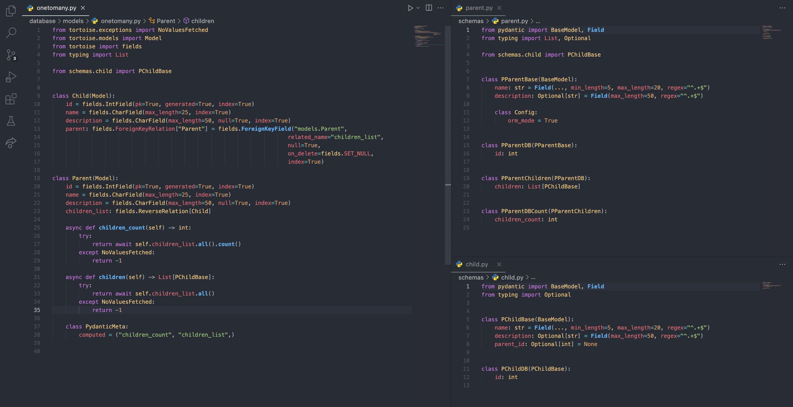
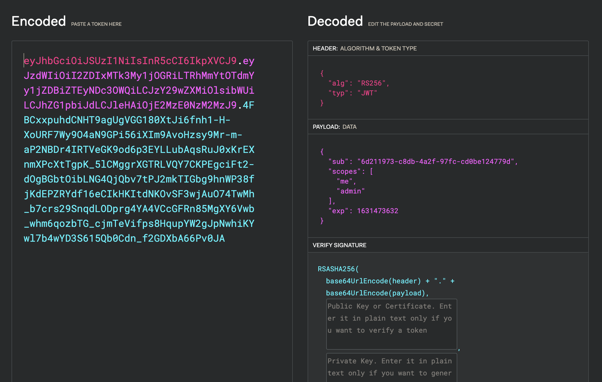
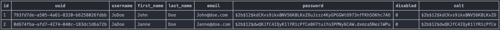

## @Summary

This project brings a lightweight and easily deployable implementation of FastAPI and is used to act as a template in personal projects.

It is mainly based on the great documentation of [FastAPI](https://fastapi.tiangolo.com/), the official documentation of [Tortoise](https://tortoise-orm.readthedocs.io/) and uses the following technologies :    

| Component  | Technology       |
| ---------- | ---------------- |
| Database   | SQLite           |
| ORM        | Tortoise-orm     |
| Deployment | Python or Docker |

Other Keywords : OAuth2, JWT, CRUD, MtM, OtM, Pydantic, HTTPS, RSA, Scopes, Regex, CORS, Unit Tests, Middleware.

---

## @Deployment

> With Python on **Linux**

    python3 -m pip install virtualenv
    virtualenv venv
    source venv/bin/activate
    python3 -m pip install -r requirements.txt
    python3 main.py

> With Python on **Windows**

    python3 -m pip install virtualenv
    python3 -m virtualenv venv
    venv\Scripts\activate
    python3 -m pip install -r requirements.txt
    python3 main.py

> As a **Docker** 


    docker build -t <IMAGE_NAME> .
    docker run -d --name <CONTAINER_NAME>  -p <LOCAL_PORT>:8000 <IMAGE_NAME>

> You can then reach the API on your browser

    https://<YOUR_IP>:<PORT>/

---

## @API Capabilities

The project offers multiple examples of classes and for each of them, a set of methods are implemented according to the **CRUD** model. 

On one hand, the Parent & Child classes represent the **One to Many** relationship.
On the other hand, the Course & Student classes represent the **Many to Many** relationship.

**Pydantic** models are used to facilitate the integration of database models in the application, as well as the reading and managing of incoming and outgoing data structures. 

Those models integrate multiple examples of **validators** in order to sanitize data structures and to reduce the number of malformed packets.




The integration of **pagination** allows you to decrease the weight of the responses sent by the API and provides a more powerful search on the client side. 
e.g. you have to list all of your items in a mobile app and only load content on demand, and not all at once.

---

## @Authentication & permissions

The authentication is mainly handled by the **Oauth2** standard and the usage of **JWTs**.

The majority of the methods that handle authentication originate from the documentation provided by FastAPI but others have been added or adapted.

e.g the modification of personal passwords, JWTs signature parameters, hash management and expiration times.
All those parameters can be adjusted, depending on your needs, in **config/parameters.py**.

### @Tokens

The structure of JWTs is the one represented in the following image.
The JWTs are signed with the RS256 algorithm which requires an asymmetric key pair, but patches the main weaknesses of HS256, the default algorithm.



**Tokens are not stored in the database because they are not used as reference tokens.**

### @Scopes

The API integrates the use of **Scopes** ( which are stored in the JWT provided to the user ) and allows you to define all the permissions that will be assigned to your users. These are provided to the user during his authentication on the OpenAPI portal ( Swagger ).

The list of existing scopes is defined in **config/parameters.py**. These scopes can then be associated with the desired methods through the use of the **Security** dependency.

```py
@router.put("/ChangePass/", response_model=PUserDB)
async def change_user_password(passwords: PUserChangePass,
                               current_user: User = Security(get_current_active_user, 
                                                             scopes=["me"])) -> User:
    if await verify_user(current_user.uuid):
        return await users.update_user_password(passwords, current_user.uuid)
```

### @User profiles

UUID are used through the application instead of database IDs.
User passwords and salts are hashed in **bcrypt** format.



---

## @Security Concerns

**Disclaimer: this project is ABSOLUTELY NOT production ready, don’t even think using this API in its current state in another usage than learning purpose, student projects or POC environments.**

The security of this application is currently rudimentary, but it still implements the following key considerations:


- Communications are encrypted with **HTTPS**.
- **CORS** prevents communications between the application and any undesired domains.
- **Trusted Hosts** prevent any undesired users from accessing the API.
- **Middleware** provides full incoming requests and responses treatments before they reach API endpoints. 
- **Allowed Methods** prevent undesired actions to reach the API. 
  
**If you consider using this project personally, don’t forget to change all keys according to the algorithms used. Do not store them in the app folder and change their path to a more secure folder e.g. on your server, your database or whatever secure environment !**

---

## @Testing your API

An example of test file is included in the project. It implements valid & invalid CRUD capabilities to help you adapt the API & to facilitate its review once modified.

You can find all configurations for these tests in the **conftest file** at the root of the project. 

If you want to add other tests, don't forget to prefix the name of your file with **test_** e.g. test_user.py. It's a Python convention that allows Pytest to automatically find your test files.


    python3 -m pytest
